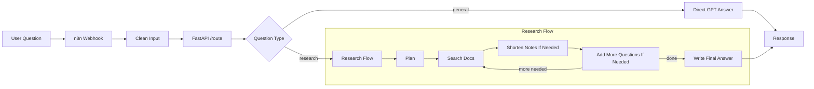

# Deep Research Agent

This project is a research assistant that answers harder questions using a small document set, while staying inside clear token, chunk, and cost limits.

It was built for the G3 "Deep Research Agent + Memory Constraints" task.

The stack is simple:

- FastAPI for the API
- LangGraph to run the research steps
- ChromaDB to search the local document set
- OpenAI `gpt-4o-mini` for planning and writing the final answer
- n8n as a light webhook layer

## What This Project Does

Instead of sending the user question to the model in one big prompt, the app does the work in steps:

1. break the question into smaller questions
2. search the local document set
3. shorten the notes if they get too large
4. add follow-up questions if important facts are still missing
5. write the final answer

The main goal is not to sound smart at all costs. The main goal is to stay within limits and avoid pretending the document set said something when it did not.

## What Makes It Different

- It has clear limits for cost, tokens, chunks, and re-runs.
- It can say "no evidence found" instead of making things up.
- It routes off-topic questions away from the research flow.
- It keeps the workflow small enough to understand and test.

## Files To Read First

- [docs/ARCHITECTURE.md](docs/ARCHITECTURE.md): how the system works
- [docs/RUNBOOK.md](docs/RUNBOOK.md): how to run and check it
- [evaluation.md](evaluation.md): why I made these design choices
- [SELF_ASSESSMENT.md](SELF_ASSESSMENT.md): honest review against the rubric

## Simple System Diagram



## Example Output

Below is a shortened example of what the `/route` endpoint can return for an in-scope question:

```json
{
  "answer": "Cursor is positioned as an AI-first code editor, while Replit focuses more on browser-based development and collaboration. In the corpus, Cursor is shown as stronger for editor-native workflows, while Replit is easier to use fully in the cloud. Pricing and trade-offs depend on the plan and the type of user.",
  "routed_to": "research_pipeline",
  "router_label": "research",
  "sub_questions": [
    "What is Cursor's product positioning and pricing?",
    "What is Replit's product positioning and pricing?",
    "How do Cursor and Replit differ in strengths and trade-offs?"
  ],
  "sections": [
    {
      "sub_question": "What is Cursor's product positioning and pricing?",
      "finding": "Cursor is described as an AI-first code editor with paid plans in the corpus.",
      "confidence": "high"
    },
    {
      "sub_question": "How do Cursor and Replit differ in strengths and trade-offs?",
      "finding": "Cursor is stronger for editor-based workflows, while Replit is stronger for browser-based use and collaboration.",
      "confidence": "medium"
    }
  ],
  "key_insights": [
    "Both tools target AI-assisted coding, but the product shape is different.",
    "The best choice depends on whether the user wants a local editor flow or a browser-first flow."
  ],
  "limitations": [
    "Some comparison details depend on what was present in the local document set."
  ],
  "sources_used": [
    "01_cursor.md",
    "03_replit.md",
    "13_tool_comparison.md"
  ],
  "budget_report": {
    "estimated_cost_usd": 0.001234,
    "retrieved_chunks": 8,
    "replans_used": 1
  },
  "memory_state": {
    "evidence_chunks": 8,
    "compressed_summaries": 1,
    "skipped_chunks": 0
  },
  "elapsed_seconds": 12.4
}
```

## Main Parts

| Part | Plain meaning |
|---|---|
| `n8n` | receives webhook requests and forwards them |
| `FastAPI /route` | decides if the question should use research or a normal GPT answer |
| `LangGraph` | runs the research steps in order |
| `ChromaDB` | searches the local document set |
| `BudgetTracker` | keeps the run inside the set limits |
| `MemoryStore` | keeps notes and shortens them when needed |

## Memory Plan

The app uses a simple three-level memory setup:

1. current working notes for the step
2. saved evidence chunks from the document search
3. shorter summary notes when the evidence gets too large

Why this helps:

- lower cost
- smaller prompts
- less chance of the model losing focus

## Limits

Default limits:

| Limit | Default | What happens |
|---|---|---|
| Max context per step | `800` tokens | notes are shortened |
| Max chunks | `20` | lower-priority chunks are skipped |
| Max run cost | `$0.05` | the run stops early and writes the best answer it can |
| Max replan count | `2` | no more extra questions are added |

## Quick Start

### 1. Install

```bash
python -m venv venv
source venv/bin/activate
pip install -r requirements.txt
```

### 2. Set the API key

```bash
cp .env.example .env
```

Then set:

```bash
OPENAI_API_KEY=your-key
```

### 3. Build the local search store

```bash
python ingest.py
```

### 4. Run tests

```bash
pytest -q
```

### 5. Start the API

```bash
uvicorn app.main:app --reload --port 8000
```

### 6. Optional: start n8n

```bash
docker-compose up
```

Then import [n8n/workflow.json](n8n/workflow.json) into n8n and turn the workflow on.

## Basic Checks

### Health check

```bash
curl -s http://localhost:8000/health | jq
```

Expected shape:

```json
{
  "status": "ok",
  "openai_configured": true,
  "corpus_chunks": 30
}
```

### Off-topic question

```bash
curl -s -X POST http://localhost:8000/route \
  -H "Content-Type: application/json" \
  -d '{"query":"what is ramayana"}' | jq
```

Expected:

- `routed_to: "direct_gpt"`

### In-scope question

```bash
curl -s -X POST http://localhost:8000/route \
  -H "Content-Type: application/json" \
  -d '{"query":"what is cursor vs replit"}' | jq
```

Expected:

- `router_label: "research"`
- `routed_to: "research_pipeline"` if the local docs contain enough evidence
- `routed_to: "direct_gpt_fallback"` if the question is in scope but the local docs do not contain useful evidence

### Run research directly

```bash
curl -s -X POST http://localhost:8000/research \
  -H "Content-Type: application/json" \
  -d '{"query":"Compare Cursor vs Copilot pricing and risks"}' | jq
```

## API Endpoints

### `POST /classify`

Returns only the route label:

```json
{"route":"research","query_echo":"what is cursor vs replit"}
```

### `POST /route`

Checks the question and returns:

- a research answer
- a normal GPT answer
- or a fallback GPT answer if research found no useful evidence

### `POST /research`

Runs the research flow directly.

### `GET /health`

Shows whether:

- OpenAI is configured
- the local search store is ready

Docs are also available at `GET /docs`.

## Tests

The test suite checks the most important risky cases:

- blank or invalid requests fail early
- Cursor product questions stay on the research path
- SQL/UI cursor questions stay on the general path
- no-evidence research does not call the model for a fake grounded answer
- duplicate chunks are not added again later
- hard cutoffs still keep the planned sub-questions
- `/route` falls back safely when the docs do not contain useful evidence

Run:

```bash
pytest -q
```

## Why n8n Is Here

The task asked for `n8n/Dify` in the workflow. In this project, n8n is used as the outer wrapper, not the main decision-maker.

n8n does:

- receive webhook calls
- clean simple input
- forward the request to FastAPI `/route`
- return the result

n8n does not:

- decide the core routing logic
- manage the research memory
- run the research loop

This keeps the main logic in Python, which makes the system easier to test and less fragile.

Workflow image:


## Repo Map

| File | What it is for |
|---|---|
| `README.md` | main overview and quick start |
| `docs/ARCHITECTURE.md` | simple system explanation |
| `docs/RUNBOOK.md` | setup, checks, and troubleshooting |
| `evaluation.md` | design trade-offs |

## Repo Structure

```text
app/
  main.py             API app and research flow
  router.py           question router
  planner.py          question breakdown
  retriever.py        local search
  memory.py           note storage and shortening
  synthesizer.py      final answer writer
  budget.py           limit tracking
  utils.py            shared helper code
data/
  *.md                local document set
tests/
  test_api.py         API behavior tests
  test_pipeline.py    memory and budget tests
  test_router.py      routing tests
n8n/
  workflow.json       thin webhook flow
```


