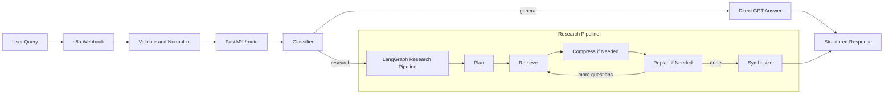

# Deep Research Agent

Production-style prototype of a budget-constrained research agent that answers complex questions over a bounded corpus while operating under explicit token, retrieval, and cost limits.

This submission was built for the G3 "Deep Research Agent + Memory Constraints" assessment. It combines:

- LangGraph for multi-step research orchestration
- ChromaDB for local vector retrieval
- OpenAI `gpt-4o-mini` for planning, replanning, and synthesis
- FastAPI for the API surface and routing logic
- n8n as a thin webhook/integration layer

## Executive Summary

The system is designed to answer queries that require structured research over a curated corpus of AI developer tooling documents. It does not treat the LLM as a single-shot answer engine. Instead, it:

1. plans sub-questions
2. retrieves relevant corpus evidence
3. compresses evidence when memory limits are exceeded
4. optionally replans when critical gaps remain
5. synthesizes a grounded final answer with explicit limitations

The implementation prioritizes bounded behavior over optimistic behavior. If the corpus has no relevant evidence, the research path now refuses to fabricate a grounded answer.

## Submission Contents

- [Architecture deep dive](docs/ARCHITECTURE.md)
- [Runbook and verification guide](docs/RUNBOOK.md)
- [Architecture trade-offs](evaluation.md)
- [Self-assessment against rubric](SELF_ASSESSMENT.md)

## System Diagram



## Key Capabilities

- Multi-step research decomposition for complex questions
- Retrieval over a bounded local corpus using ChromaDB
- Explicit memory strategy using a summarization cascade
- Hard limits on context size, retrieved chunks, cost, and replans
- Safer zero-evidence behavior to avoid fake "grounded" answers
- Query routing that avoids wasting research budget on off-topic questions
- Thin n8n workflow for webhook-driven integrations

## Architecture at a Glance

| Layer | Responsibility |
|---|---|
| `n8n` | Webhook entrypoint, light validation, request normalization, proxy to FastAPI |
| `FastAPI /route` | Query classification, route selection, direct-answer fallback |
| `LangGraph` | Stateful research orchestration with loop control |
| `ChromaDB` | Local vector retrieval over the curated markdown corpus |
| `BudgetTracker` | Hard constraints on token budget, chunk budget, replans, and cost |
| `MemoryStore` | Evidence accumulation and compression cascade |

## Memory Strategy

This project implements a summarization-cascade memory architecture:

- Tier 1: per-step working context
- Tier 2: retrieved evidence chunks accumulated across steps
- Tier 3: compressed summaries that replace raw evidence once token pressure becomes too high

Why this choice:

- keeps prompts small and cheap
- makes budget behavior explicit
- preserves salient facts and citations better than naive truncation

The detailed memory design is documented in [docs/ARCHITECTURE.md](docs/ARCHITECTURE.md) and [evaluation.md](evaluation.md).

## Constraints

Default runtime constraints:

| Constraint | Default | Enforcement |
|---|---|---|
| Max context tokens per step | `800` | Compress evidence before large LLM calls |
| Max retrieved chunks | `20` | Stop retrieval and record skipped chunks |
| Max cost per run | `$0.05` | Hard cutoff and early synthesis |
| Max replans | `2` | Prevent unbounded looping |

These are configurable per request through the API.

## Quick Start

### Prerequisites

- Python `3.11+` tested locally with Python `3.13.5`
- OpenAI API key
- Optional: Docker for n8n

### 1. Install

```bash
python -m venv venv
source venv/bin/activate
pip install -r requirements.txt
```

### 2. Configure environment

```bash
cp .env.example .env
```

Set at minimum:

```bash
OPENAI_API_KEY=your-key
```

### 3. Ingest the corpus

```bash
python ingest.py
```

### 4. Run tests

```bash
pytest -q
```

### 5. Start the API

```bash
uvicorn app.main:app --reload --port 8000
```

### 6. Optional: start n8n

```bash
docker-compose up
```

Then import [n8n/workflow.json](n8n/workflow.json) into n8n and activate the workflow.

## Environment Variables

`.env.example` includes the main knobs used by the project.

| Variable | Purpose | Default |
|---|---|---|
| `OPENAI_API_KEY` | OpenAI authentication | required |
| `OPENAI_MODEL` | Main LLM for planner/replanner/synthesizer | `gpt-4o-mini` |
| `ROUTER_MODEL` | Optional model override for routing classifier | inherits `OPENAI_MODEL` |
| `CHROMA_DIR` | Local Chroma persistence directory | `./chroma_store` |
| `CHROMA_COLLECTION` | Chroma collection name | `research_corpus` |
| `RAG_CORPUS_SCOPE` | Text description of what the corpus covers | built-in default |

## Verification Commands

### Health check

```bash
curl -s http://localhost:8000/health | jq
```

Expected shape:

```json
{
  "status": "ok",
  "openai_configured": true,
  "corpus_chunks": 30
}
```

### General query routed away from research

```bash
curl -s -X POST http://localhost:8000/route \
  -H "Content-Type: application/json" \
  -d '{"query":"what is ramayana"}' | jq
```

Expected:

- `routed_to: "direct_gpt"`

### In-scope product query routed to research

```bash
curl -s -X POST http://localhost:8000/route \
  -H "Content-Type: application/json" \
  -d '{"query":"what is cursor vs replit"}' | jq
```

Expected:

- `router_label: "research"`
- `routed_to: "research_pipeline"` when evidence exists
- `routed_to: "direct_gpt_fallback"` only if the query is in-scope but the corpus returns no evidence

### Direct research endpoint

```bash
curl -s -X POST http://localhost:8000/research \
  -H "Content-Type: application/json" \
  -d '{"query":"Compare Cursor vs Copilot pricing and risks"}' | jq
```

## API Overview

### `POST /classify`

Returns only the route label.

Example response:

```json
{"route":"research","query_echo":"what is cursor vs replit"}
```

### `POST /route`

Classifies the query and returns either:

- a research-pipeline response
- a direct GPT response
- a direct GPT fallback response when the research route found no corpus evidence

### `POST /research`

Runs the research pipeline directly without front-door routing.

### `GET /health`

Reports high-level service readiness:

- whether OpenAI is configured
- how many chunks are present in ChromaDB

Interactive docs are available at `GET /docs`.

## Testing and Regression Coverage

The repo includes targeted regression tests for the highest-risk behaviors:

- invalid requests are rejected early
- Cursor-related product queries stay on the research path
- SQL/UI cursor queries stay on the general path
- zero-evidence synthesis does not call the LLM
- duplicate chunks are not re-added on later retrieval passes
- hard cost cutoffs preserve the latest plan state
- `/route` falls back safely when research finds no evidence

Run:

```bash
pytest -q
```

## n8n's Role in This Submission

The assignment suggested `n8n/Dify for query routing + memory management`. In this implementation, the strongest engineering choice was to keep core logic in code and use n8n as a thin integration layer.

What n8n does:

- receives external webhook calls
- normalizes request payloads
- forwards requests to FastAPI `/route`
- returns the response to the caller

What n8n intentionally does not do:

- own routing logic
- manage memory state
- run the research loop

This keeps one source of truth for routing behavior and makes the system easier to test and reason about.

Workflow snapshot:


## Documentation Map

| File | Purpose |
|---|---|
| `README.md` | Submission overview, quick start, reproducibility, high-level architecture |
| `docs/ARCHITECTURE.md` | Detailed component design, request flows, memory model |
| `docs/RUNBOOK.md` | Setup, operational commands, troubleshooting, local verification |
| `evaluation.md` | Architecture trade-offs and design rationale |
| `SELF_ASSESSMENT.md` | Honest rubric-based assessment of the submission |

## Repository Structure

```text
app/
  main.py             FastAPI app, routing endpoint, LangGraph orchestration
  router.py           Query classifier and direct-GPT fallback path
  planner.py          Planning and replanning prompts
  retriever.py        ChromaDB retrieval and relevance filtering
  memory.py           Memory store and compression logic
  synthesizer.py      Grounded report synthesis
  budget.py           Budget tracking and hard limits
  utils.py            Shared OpenAI wrapper and logging
data/
  *.md                Curated AI developer tooling corpus
tests/
  test_api.py         API and fallback behavior
  test_pipeline.py    Memory and budget pipeline behavior
  test_router.py      Routing heuristics
n8n/
  workflow.json       Thin webhook + proxy workflow
```

dynamically crawled

